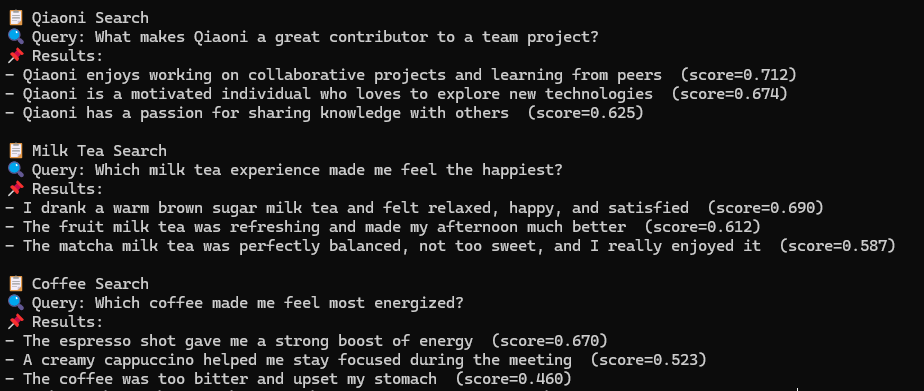

# Day 2 – Local Semantic Search with OpenAI


## What This Is

A minimal end-to-end semantic search demo running locally,
using OpenAI embeddings and Chroma, without any database.

The goal is to understand how semantic search works before introducing databases or RAG systems.

---

## How It Works

1. Sample text data is converted into embeddings using OpenAI
2. Embeddings are indexed locally with Chroma
3. A natural language query is embedded and searched by similarity

---

## How to Run

1. Install dependencies
```bash
pip install -r requirements.txt
```

2. Set environment variables
```bash
cp .env.example .env
# add your OPENAI_API_KEY
```

3. Run the demo
```bash
python demo.py
```

## Example
1. Query
```text
Which milk tea experience made me feel the happiest?
```

2. Output
```text
- I drank a warm brown sugar milk tea and felt relaxed, happy, and satisfied
- The matcha milk tea was perfectly balanced, not too sweet, and I really enjoyed it
```

## Notes
- This is a learning-focused demo
- Performance and scalability are intentionally out of scope
- The purpose is to understand embeddings-based semantic search
- Uses Chroma (in-memory) for local semantic search

## 📸 Demo Screenshot

Here’s what the output looks like when you run the demo:


 
**Note**: "The coffee was too bitter and upset my stomach  (score=0.460)". Though this is a negative experience, it's still semantically related to the query about the effects of drinking coffee.