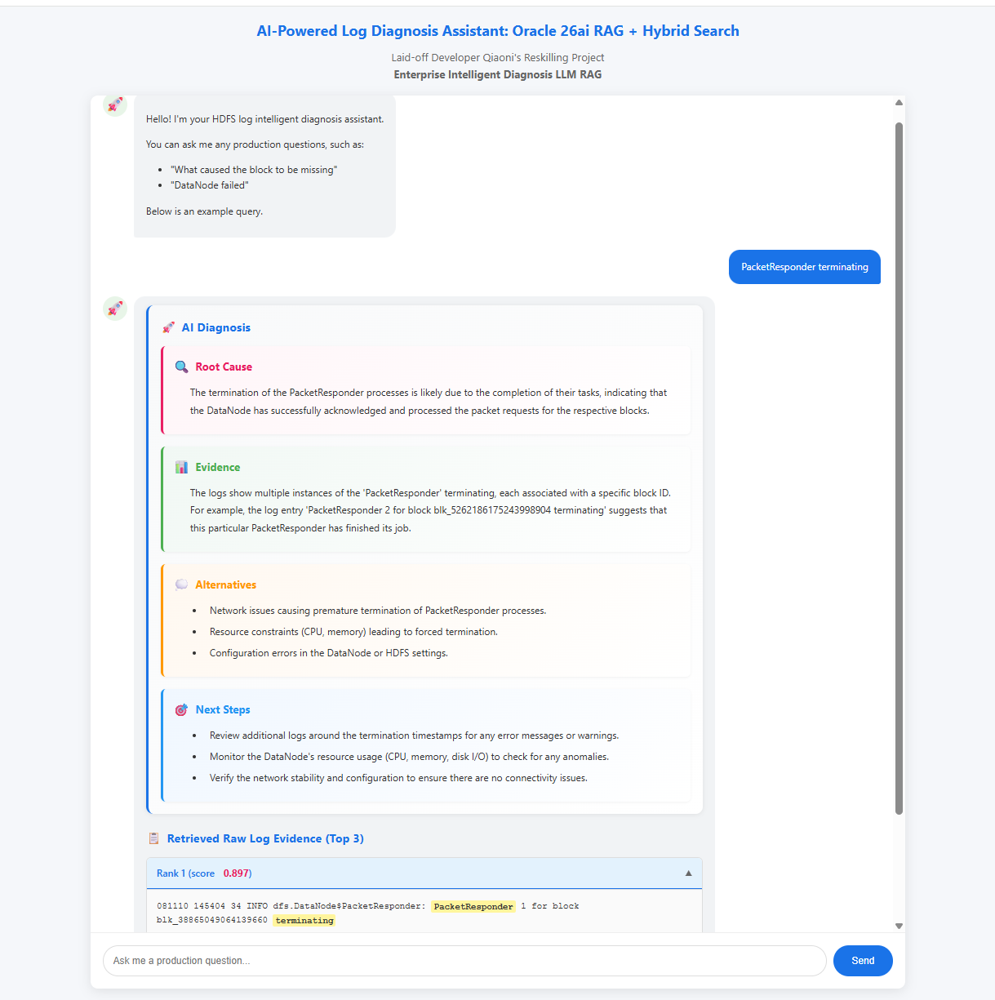

# Day20-25 Goal: Fine-tune the embedding model to optimize the semantic retrieval performance for log anomaly diagnosis.
# AI-Powered Log Diagnosis Assistant: Oracle 26ai RAG + Hybrid Search with Dynamic Upload

> **An enterprise-grade RAG system with hybrid retrieval (vector + BM25) for intelligent log diagnosis. Features dynamic file upload, real-time progress tracking, and batch processing optimization.**


*Example query result showing AI diagnosis and retrieved log evidence with similarity scores*


## 📌 Project Overview

This project is a **production-grade anomaly diagnosis system** that helps SREs move from raw logs to **interpretable anomaly hypotheses** by combining statistical signal detection with LLM-based pattern reasoning.

> **📖 For system design philosophy and problem statement, see [SYSTEM_OVERVIEW.md](./SYSTEM_OVERVIEW.md)**

**Key features:**

- **OpenAI text embeddings** (text-embedding-3-large)
- **Oracle Autonomous Database 26ai** native vector search
- **BM25 keyword search** for lexical matching
- **Hybrid fusion** (70% vector + 30% BM25)
- **Dynamic file upload** - Upload custom log files via web interface
- **Real-time progress tracking** - Monitor processing progress with live updates
- **Batch processing optimization** - Efficient batch embedding generation (1000 entries per batch)
- **FastAPI backend** with RESTful API
- **Modern chat-style frontend** with accordion UI

Users can:
1. **Upload custom log files** (.log, .txt, .gz) up to 5000 entries
2. **Monitor real-time progress** during processing
3. **Ask natural language questions** such as:
   - *"What caused the block to be missing?"*
   - *"Why did the DataNode stop responding?"*
   - *"PacketResponder terminating"*

The system retrieves the **top 3 most relevant logs** using hybrid search and generates a **concise AI diagnosis** based strictly on retrieved evidence.
---

## 🚀 Key Features

### 1. Dynamic File Upload
- **Web-based upload interface** - Drag and drop or click to select files
- **Multiple file formats** - Supports .log, .txt, and .gz (compressed) files
- **Automatic processing** - Uploaded files are automatically parsed, embedded, and indexed
- **Data management** - New uploads automatically replace existing data
- **Size limits** - Maximum 5000 log entries per file

### 2. Real-Time Progress Tracking
- **Live progress updates** - Real-time progress bar showing processing status
- **Progress API endpoint** - `/progress` endpoint provides current status
- **Detailed status information** - Shows processed/total entries, elapsed time, and current stage
- **Batch progress** - Tracks embedding generation progress per batch

### 3. Hybrid Search Architecture
- **Vector Search (70%)**: Semantic similarity using OpenAI embeddings + Oracle 26ai
- **BM25 Keyword Search (30%)**: Traditional lexical matching for exact term matches
- **Fusion Scoring**: Combines both approaches for optimal retrieval

### 4. Batch Processing Optimization
- **Efficient embedding generation** - Processes up to 1000 entries per API call
- **Automatic batching** - Large files are automatically split into batches
- **Progress tracking** - Real-time updates during batch processing
- **Optimized database insertion** - Bulk insert operations for better performance

### 5. Modern Chat Interface
- Real-time chat-style UI
- Collapsible accordion for log evidence
- Similarity scores with intuitive display
- Keyword highlighting in results
- Responsive design for different screen sizes

### 6. Production-Ready
- Real HDFS production logs support
- Persistent vector storage in Oracle database
- Enterprise-grade error handling
- Empty corpus protection (prevents ZeroDivisionError)

---

## 📋 Prerequisites

- **Python 3.8+**
- **Oracle Autonomous Database 26ai** (with vector search enabled)
- **OpenAI API Key**
- **Oracle Wallet** for database connection

---

## 🛠️ Installation

### 1. Clone the repository

```bash
git clone https://github.com/qiaonipan/90-days-ai-backend-reborn.git
cd Day15-16-dynamic-upload
```

### 2. Install dependencies

```bash
pip install -r requirements.txt
```

### 3. Configure environment variables

Create a `.env` file in the project root:

```env
# OpenAI API Key
OPENAI_API_KEY=your_openai_api_key_here

# Oracle Database Configuration
ORACLE_USERNAME=your_oracle_username
ORACLE_PASSWORD=your_oracle_password
ORACLE_DSN=your_oracle_dsn
ORACLE_WALLET_PATH=path_to_your_wallet_directory
```

### 4. Prepare database table

Ensure your Oracle database has the `docs` table:

```sql
CREATE TABLE docs (
    id NUMBER PRIMARY KEY,
    text CLOB,
    embedding VECTOR(3072, FLOAT32)
);
```

**⚠️ Important**: If you're upgrading from `text-embedding-3-small` (1536 dimensions) to `text-embedding-3-large` (3072 dimensions), you need to alter the table:

```sql
-- Drop existing table and recreate (if you can lose existing data)
DROP TABLE docs;
CREATE TABLE docs (
    id NUMBER PRIMARY KEY,
    text CLOB,
    embedding VECTOR(3072, FLOAT32)
);

-- OR alter the column (if your Oracle version supports it)
ALTER TABLE docs MODIFY embedding VECTOR(3072, FLOAT32);
```

---

## 🚀 Quick Start

### Option 1: Use Dynamic Upload (Recommended)

1. **Start the API server**:
```bash
cd Day15-16-dynamic-upload
python -m uvicorn api:app --reload --host 0.0.0.0 --port 8000
```

2. **Access the web interface**:
   - Open http://localhost:8000/ in your browser
   - Upload your log file using the upload area
   - Monitor real-time progress
   - Start querying once upload completes

### Option 2: Pre-load Data (Optional)

If you want to pre-load sample data:

```bash
python insert_logs.py
```

This script will:
- Read HDFS logs from `data/HDFS_2k.log`
- Generate embeddings using OpenAI
- Insert data into Oracle database
- Process ~1000 log entries (takes a few minutes)

### Access Points

- **Frontend UI**: http://localhost:8000/
- **API Documentation**: http://localhost:8000/docs
- **Progress Endpoint**: http://localhost:8000/progress

---

## 📖 Usage

### Web Interface

#### Upload Custom Log Files

1. Open http://localhost:8000/ in your browser
2. **Upload your log file**:
   - Drag and drop a file onto the upload area, or
   - Click "Select File" to choose a file
   - Supported formats: `.log`, `.txt`, `.gz`
   - Maximum: 5000 log entries per file
3. **Monitor progress**:
   - Watch the real-time progress bar
   - View processing status and elapsed time
   - Wait for "Upload successful!" message
4. **Query your logs**:
   - Type your question in the chat input (e.g., "What caused the block to be missing?")
   - Press Enter or click "Send"
   - View the AI diagnosis and top 3 relevant logs with similarity scores

#### Query Existing Data

If data is already loaded:
1. Type your question in the chat input
2. Press Enter or click "Send"
3. View the AI diagnosis and retrieved log evidence

### API Endpoints

#### Upload File

```bash
curl -X POST "http://localhost:8000/upload" \
  -F "file=@your_log_file.log"
```

**Response:**
```json
{
  "message": "Upload successful! Loaded 5000 log entries (took 21.1 seconds), ready to query.",
  "chunks_loaded": 5000,
  "processing_time_seconds": 21.1
}
```

#### Check Progress

```bash
curl "http://localhost:8000/progress"
```

**Response:**
```json
{
  "total": 5000,
  "processed": 2500,
  "status": "processing",
  "elapsed_seconds": 10.5
}
```

#### Search Query

```bash
curl -X POST "http://localhost:8000/search" \
  -H "Content-Type: application/json" \
  -d '{
    "query": "What caused the block to be missing?",
    "top_k": 3
  }'
```

**Response:**
```json
{
  "query": "What caused the block to be missing?",
  "ai_summary": "This usually indicates network timeout or node overload...",
  "retrieved_logs": [
    {
      "rank": 1,
      "text": "081110 145404 34 INFO dfs.DataNode$PacketResponder: ...",
      "hybrid_score": 0.892,
      "distance": 0.108
    },
    ...
  ],
  "note": "Results from hybrid retrieval (vector 70% + BM25 30%)"
}
```

---

## 🏗️ System Architecture

> **📖 For detailed system design philosophy, problem statement, and technical decisions, see [SYSTEM_OVERVIEW.md](./SYSTEM_OVERVIEW.md)**

The system follows a **three-stage pipeline** for production-grade anomaly diagnosis:

```
┌─────────────────────────────────────────┐
│         File Upload Flow                 │
│  User uploads .log/.txt/.gz file        │
│    ↓                                     │
│  Parse & validate (max 5000 entries)    │
│    ↓                                     │
│  Batch generate embeddings (1000/batch)  │
│    ↓                                     │
│  Bulk insert into Oracle database        │
│    ↓                                     │
│  Reload BM25 index                       │
│    ↓                                     │
│  Ready for queries                       │
└─────────────────────────────────────────┘

┌─────────────────────────────────────────┐
│         Query Flow                       │
│  User Query                              │
│    ↓                                     │
│  OpenAI Embedding (text-embedding-3-large)│
│    ↓                                     │
│  ┌─────────────────────────────────────┐ │
│  │      Hybrid Search Engine           │ │
│  │  ┌─────────────┐  ┌──────────────┐ │ │
│  │  │   Vector    │  │    BM25      │ │ │
│  │  │  Search 70% │  │  Search 30%  │ │ │
│  │  └─────────────┘  └──────────────┘ │ │
│  │         ↓              ↓            │ │
│  │      Fusion Scoring                 │ │
│  └─────────────────────────────────────┘ │
│    ↓                                     │
│  Top 3 Relevant Logs                     │
│    ↓                                     │
│  LLM Evidence-Based Summary (GPT-4o-mini)│
│    ↓                                     │
│  Frontend Rendering (Chat UI)            │
└─────────────────────────────────────────┘
```

---

## 🔧 Technical Details

### Hybrid Search Algorithm

1. **Vector Search**: 
   - Uses Oracle `VECTOR_DISTANCE` function
   - Returns top 2×k candidates
   - Normalizes scores to 0-1 range

2. **BM25 Search**:
   - Tokenizes query and corpus
   - Calculates BM25 scores
   - Returns top 2×k candidates

3. **Fusion**:
   - Vector score × 0.7 + BM25 score × 0.3
   - Ranks by fused score
   - Returns top k results

### Similarity Score Calculation

- **Formula**: `similarity = 1 - distance`
- **Range**: 0.0 - 1.0 (higher is better)
- **Display**: Typically shows 0.5 - 0.9 for relevant results

### File Upload & Processing

1. **File Upload**:
   - Accepts `.log`, `.txt`, and `.gz` (compressed) files
   - Validates file format and size
   - Parses log entries (minimum 20 characters per entry)
   - Limits to 5000 entries per file

2. **Batch Embedding Generation**:
   - Splits log entries into batches of 1000 (OpenAI API limit)
   - Generates embeddings for each batch
   - Updates progress after each batch completion
   - Combines all embeddings for database insertion

3. **Database Operations**:
   - Truncates existing table before insert
   - Uses explicit IDs starting from 1
   - Bulk insert for optimal performance
   - Automatic BM25 index reload after insertion

4. **Progress Tracking**:
   - Global `upload_progress` dictionary tracks state
   - `/progress` endpoint provides real-time status
   - Frontend polls every 300-800ms for updates
   - Shows processed/total entries and elapsed time

### Frontend Features

- **Chat Interface**: Real-time message display
- **Accordion UI**: Collapsible log evidence panels
- **Keyword Highlighting**: Auto-highlights query terms
- **Responsive Design**: Adapts to different screen sizes
- **File Upload UI**: Drag-and-drop or click to select
- **Progress Display**: Real-time progress bar and status updates

---

## 📁 Project Structure

```
Day15-16-dynamic-upload/
├── api.py                 # FastAPI backend with hybrid search + file upload
├── insert_logs.py         # Optional: Pre-load data script
├── search.py              # Optional: Simple search test script
├── requirements.txt       # Python dependencies
├── .env                  # Environment variables (create this)
├── data/
│   └── HDFS_2k.log      # Sample HDFS production logs
├── static/
│   └── index.html       # Frontend with upload UI + chat interface
└── screenshots/
    └── cause-oriented_RAG.png   # Example screenshots
```

---

## 🎯 Key Improvements Over Previous Versions

### Dynamic Upload (Day 15-16) - NEW! 🎉
- ✅ **Web-based file upload** - No need to run scripts manually
- ✅ **Real-time progress tracking** - Monitor processing with live updates
- ✅ **Batch processing optimization** - Efficient embedding generation (1000 entries per batch)
- ✅ **Multiple file format support** - .log, .txt, .gz (compressed)
- ✅ **Automatic data management** - New uploads replace existing data automatically
- ✅ **Progress API endpoint** - `/progress` for real-time status monitoring
- ✅ **Empty corpus protection** - Prevents errors when database is empty

### Hybrid Search (Day 10-11)
- ✅ Combined vector + BM25 search
- ✅ Improved retrieval accuracy
- ✅ Better handling of exact keyword matches

### UI Enhancements
- ✅ Modern chat-style interface
- ✅ Accordion for log evidence
- ✅ Intuitive similarity scores
- ✅ Responsive design
- ✅ File upload interface with drag-and-drop

### Code Quality
- ✅ All comments in English
- ✅ Clean code structure
- ✅ Comprehensive error handling
- ✅ Type hints and documentation
- ✅ Production-ready error messages

---

## 🔍 Example Queries

Try these queries to see the system in action:

- `"What caused the block to be missing"`
- `"DataNode failed"`
- `"PacketResponder terminating"`
- `"Why did replication fail"`
- `"Network timeout issues"`

---

## 🐛 Troubleshooting

### Issue: `uvicorn` command not found

**Solution**: Use `python -m uvicorn` instead:
```bash
python -m uvicorn api:app --reload --host 0.0.0.0 --port 8000
```

### Issue: Database connection failed

**Solution**: 
- Check `.env` file configuration
- Verify Oracle wallet path
- Ensure network access to Oracle database

### Issue: OpenAI API errors

**Solution**:
- Verify `OPENAI_API_KEY` in `.env`
- Check API quota and billing

### Issue: No logs found

**Solution**:
- Upload a log file via the web interface (recommended)
- Or run `insert_logs.py` to populate database
- Check database connection
- Verify `docs` table has data

### Issue: Upload fails or progress not updating

**Solution**:
- Check file format (must be .log, .txt, or .gz)
- Ensure file has valid log entries (each entry must be at least 20 characters)
- Check file size (max 5000 entries)
- Verify `/progress` endpoint is accessible
- Check browser console for errors

---

## 📊 Performance

### Query Performance
- **Query Response Time**: ~2-3 seconds (including LLM generation)
- **Vector Search**: < 100ms (Oracle 26ai native)
- **BM25 Search**: < 50ms (in-memory)
- **LLM Generation**: ~1-2 seconds (GPT-4o-mini)

### Upload Performance
- **File Parsing**: < 1 second for 5000 entries
- **Embedding Generation**: ~15-25 seconds for 5000 entries (batch processing)
- **Database Insertion**: ~1-2 seconds for 5000 entries (bulk insert)
- **BM25 Index Reload**: < 1 second
- **Total Upload Time**: ~20-30 seconds for 5000 entries

---

## 🛣️ Roadmap

### Completed (Day 15-16)
- [x] Dynamic file upload via web interface
- [x] Real-time progress tracking
- [x] Batch processing optimization
- [x] Multiple file format support (.log, .txt, .gz)
- [x] Progress API endpoint
- [x] Empty corpus error handling

### Planned Improvements

- [ ] Incremental upload (append instead of replace)
- [ ] Multiple file upload support
- [ ] Upload history and file management
- [ ] Failure-aware semantic enrichment
- [ ] Two-stage retrieval with reranking
- [ ] Confidence and coverage signals
- [ ] Timeline reconstruction
- [ ] Multi-language support
- [ ] Advanced filtering options

---

## 📝 License

This project is part of a personal reskilling journey and is provided as-is for educational purposes.

---

## 🙏 Acknowledgments

- **Oracle 26ai** for native vector search capabilities
- **OpenAI** for embeddings and LLM
- **FastAPI** for the excellent web framework
- Real HDFS production logs for realistic testing

---

## 📧 Contact

For questions or feedback, please open an issue on GitHub.

---

**Built with ❤️ as part of a reskilling journey after layoff**
